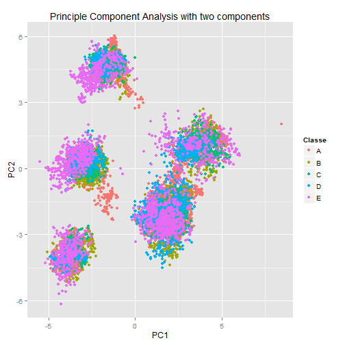

# Predict Exercise grades using ML

## Reading the data

Initially, the training data is loaded into R. The read.csv function is used to load the training data into a data frame.

## Split into training and test set.
Using the caret, the training dataset is then split into a training and test dataset using the createDataPartition function. The data is randomly sampled with 60% of the data belonging to the training dataset. 

## Cleaning the data

Looking at the columns in the training data set, it is noticible that many of the features have a large number of 'NA' fields. In order to build a model, all the features with large proportion of NA values are removed. Any feature more than 95% NA values are eliminated from the dataset. 

After removing the features with a high proportion of NAs, it is noticible that several of the remaining coloumns have a large number of blank entries. In order to check if these are useful, we use the nearZeroVar function to evaluate the variance of the features. A few of the features have near zero variance. These are also eliminated from the training data.

Finally, the first few columns of the dataset contain row numbers, user names and time related information. These features are not useful in building a predictive model and are eliminated from the datatset. 

As a result, we are left with a training dataset of 53 features. The same transformations are also applied to the testing subset of train dataset.

## Pre-processing the training data
The first step in pre-processing involves running a priciple component analysis and generating only principle components.

 

From the figure, we can see some segregation among the different classes even with just two components. 

For the final model, we run principle component analysis on the training data with a threshold of 90%.

